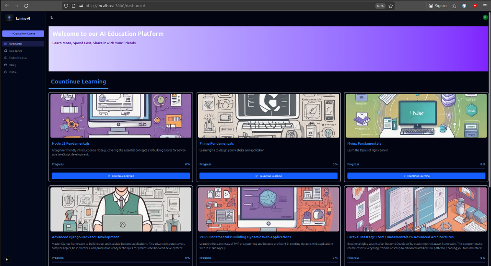
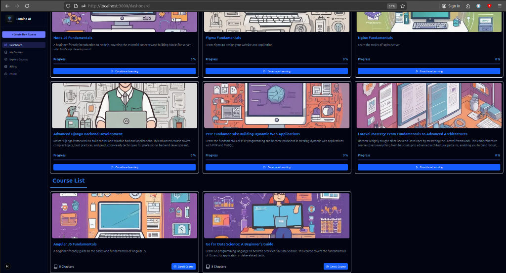
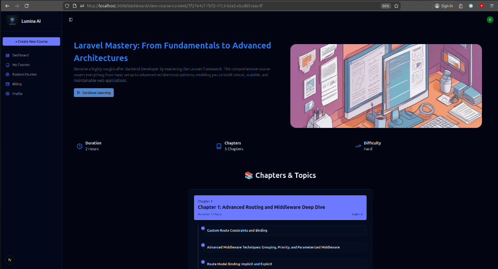
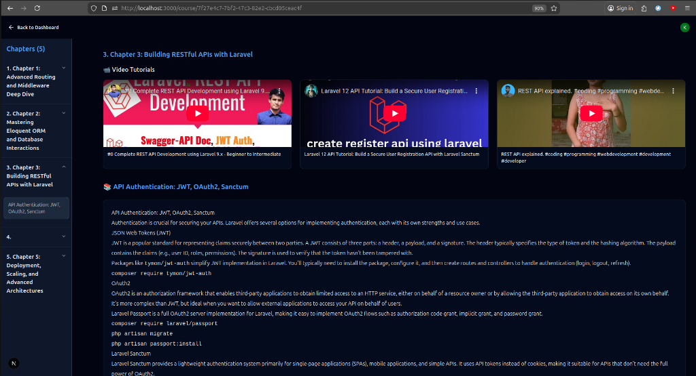

# 🎓 Lumina AI - AI-Powered Education Platform

An intelligent course generation platform that leverages AI to create personalized learning experiences. Built with Next.js, this platform enables educators and learners to generate comprehensive courses with AI-powered content, video recommendations, and interactive learning paths.

## ✨ Features

- **🤖 AI Course Generation**: Automatically generate complete courses using Google's Gemini AI
- **📚 Personalized Learning Paths**: Create custom courses tailored to specific topics, difficulty levels, and learning goals
- **🎥 Video Integration**: Automatic YouTube video recommendations for each chapter
- **📊 Progress Tracking**: Monitor learning progress with visual indicators
- **🔐 Secure Authentication**: User authentication powered by Clerk
- **🎨 Modern UI**: Beautiful, responsive interface with dark mode support
- **💳 Billing System**: Integrated pricing plans (Free & Pro)
- **📱 Fully Responsive**: Optimized for desktop, tablet, and mobile devices

## 🚀 Tech Stack

- **Framework**: [Next.js 14](https://nextjs.org/) (App Router)
- **Language**: JavaScript
- **Styling**: Tailwind CSS
- **UI Components**: Shadcn/ui
- **Authentication**: [Clerk](https://clerk.com/)
- **Database**: PostgreSQL with [Drizzle ORM](https://orm.drizzle.team/)
- **AI Integration**: Google Gemini API
- **Image Generation**: Custom AI image generation API
- **Video API**: YouTube Data API v3

## 📋 Prerequisites

Before you begin, ensure you have the following installed:
- Node.js 18.x or higher
- npm, yarn, pnpm, or bun
- PostgreSQL database

## 🛠️ Installation

1. **Clone the repository**
   ```bash
   git clone https://github.com/Osama-2024-Ahmad/education-platform.git
   cd education-platform
   ```

2. **Install dependencies**
   ```bash
   npm install
   # or
   yarn install
   # or
   pnpm install
   ```

3. **Set up environment variables**
   
   Create a `.env` file in the root directory and add the following:
   ```env
   # Database
   DATABASE_URL=your_postgresql_connection_string

   # Clerk Authentication
   NEXT_PUBLIC_CLERK_PUBLISHABLE_KEY=your_clerk_publishable_key
   CLERK_SECRET_KEY=your_clerk_secret_key

   # Google Gemini AI
   GEMINI_API_KEY=your_gemini_api_key

   # YouTube API
   YOUTUBE_API=your_youtube_api_key

   # Image Generation API
   API_KEY=your_image_generation_api_key
   ```

4. **Set up the database**
   ```bash
   npm run db:push
   # or use your preferred Drizzle ORM migration command
   ```

5. **Run the development server**
   ```bash
   npm run dev
   # or
   yarn dev
   # or
   pnpm dev
   ```

6. **Open your browser**
   
   Navigate to [http://localhost:3000](http://localhost:3000) to see the application.

## 📁 Project Structure

```
education-platform/
├── app/                      # Next.js app directory
│   ├── (auth)/              # Authentication pages
│   ├── api/                 # API routes
│   ├── course/              # Course viewing pages
│   ├── dashboard/           # Dashboard and course management
│   └── page.js              # Landing page
├── components/              # Reusable UI components
│   └── ui/                  # Shadcn/ui components
├── config/                  # Configuration files
│   ├── db.js               # Database configuration
│   └── schema.js           # Database schema
├── context/                # React context providers
├── public/                 # Static assets
└── middleware.js           # Next.js middleware for auth
```

## 🎯 Key Features Explained

### AI Course Generation
The platform uses Google's Gemini AI to generate structured course content including:
- Course outline with chapters and topics
- Detailed learning objectives
- Estimated duration for each chapter
- Relevant learning materials

### Course Management
- Create unlimited courses (Pro plan)
- Edit course structure and content
- Track enrolled students
- Monitor learning progress

### User Roles
- **Students**: Enroll in courses, track progress, access learning materials
- **Instructors**: Create and manage courses, view analytics

## 🔧 Configuration

### Clerk Authentication Setup
1. Create a Clerk account at [clerk.com](https://clerk.com)
2. Create a new application
3. Copy your API keys to `.env`
4. Configure sign-in/sign-up pages in Clerk dashboard

### Database Setup
The application uses PostgreSQL with Drizzle ORM. The schema includes:
- `users` - User profiles
- `courses` - Course information
- `enrollToCourse` - Course enrollment tracking

## 📝 Available Scripts

- `npm run dev` - Start development server
- `npm run build` - Build for production
- `npm start` - Start production server
- `npm run lint` - Run ESLint

## 🌐 Deployment

[Live Demo](https://education-platform-nu-amber.vercel.app)

## 🤝 Contributing

Contributions are welcome! Please feel free to submit a Pull Request.

1. Fork the project
2. Create your feature branch (`git checkout -b feature/AmazingFeature`)
3. Commit your changes (`git commit -m 'Add some AmazingFeature'`)
4. Push to the branch (`git push origin feature/AmazingFeature`)
5. Open a Pull Request

## 📄 License

This project is licensed under the MIT License - see the LICENSE file for details.

## 👥 Authors

- **Osama Ahmad** - [GitHub](https://github.com/Osama-2024-Ahmad)

## 🙏 Acknowledgments

- Next.js team for the amazing framework
- Clerk for authentication services
- Google for Gemini AI API
- Shadcn for beautiful UI components

## 🔗 Links

- [Live Demo](https://education-platform-nu-amber.vercel.app)

## 📸 Screenshots

### Dashboard


### Course List


### Course Detail


### Video Content

